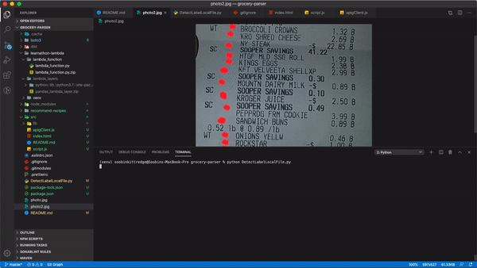

# Show me what you bought - Receipt parser

This is Guild Education's Learnathon project by Soobin Kittredge (Salesforce Developer)

#### making the code work

- Create AWS user for Rekognition
- Clone example Python code for testing
- install boto3 package for python (https://github.com/boto/boto3)
- Modify example code to call detect_text function
- follow instruction on boto3 to install relevant packages/modules (https://github.com/boto/boto3)
- add boto3 as gitmodule
- seems like the python works as intended in my machine

#### try to push this to cloud maybe?

- create new python & adjust to be lambda function
- put python in lambda service
- trying to figure out how to make api endpoint for calling lambda python?
- create website to call the lambda
  - AWS SDK downloaded from API Gateway
- npm init / npm install parcel-bundler : try to run localhost to call lambda API
- create website from S3 to call the api endpoint (where this project is so far)

---

## Thing played around today

- aws
  - Lambda, API Gateway
  - S3 bucket, hosting static website (https://docs.aws.amazon.com/sdk-for-javascript/v2/developer-guide/using-lambda-s3-setup.html)
  - rekognition : [Official AWS Rekognition Image Tutorial](https://docs.aws.amazon.com/rekognition/latest/dg/images-bytes.html)
- python
- npm
